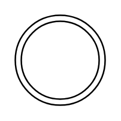

# Multiple Process / Start State / Multi State

## Definition

```
{
  _style: { 
    entity: 'ellipse;shape=doubleEllipse;html=1;dashed=0;whiteSpace=wrap;aspect=fixed;',
  },
  _width: 60,
  _height: 60,
}
```

## Usage

```
import { MultipleProcessStartStateMultiState } from '@diac/standard-components-diagrams/dataFlowDiagram'

<MultipleProcessStartStateMultiState/>
```

## Preview


