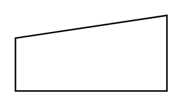

# Order / Command

## Definition

```
{
  _style: 'shape=manualInput;whiteSpace=wrap;html=1;dashed=0;size=15;',
  _width: 100,
  _height: 50,
}
```

## Usage

```
import { OrderCommand } from '@diac/standard-components-diagrams/dataFlowDiagram'

<OrderCommand/>
```

## Preview


