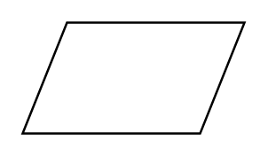

# Product / Result

## Definition

```
{
  _style: { 
    entity: 'shape=parallelogram;perimeter=parallelogramPerimeter;whiteSpace=wrap;html=1;dashed=0;',
  },
  _original_width: 100,
  _original_height: 50,
}
```

## Usage

```
import { ProductResult } from '@diac/standard-components-diagrams/dataFlowDiagram'

<ProductResult/>
```

## Preview


