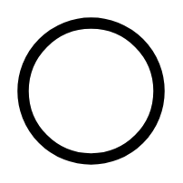

# Stop State

## Definition

```
{
  _style: { 
    entity: 'shape=ellipse;html=1;dashed=0;whiteSpace=wrap;aspect=fixed;strokeWidth=5;perimeter=ellipsePerimeter;',
  },
  _original_width: 60,
  _original_height: 60,
}
```

## Usage

```
import { StopState } from '@dinghy/standard-components-diagrams/dataFlowDiagram'

<StopState/>
```

## Preview


