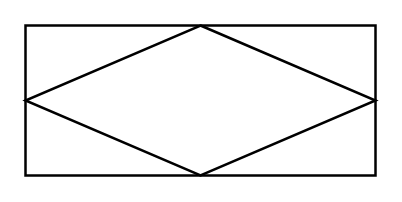

# Associative Entity

## Definition

```
{
  _style: { 
    entity: 'shape=associativeEntity;whiteSpace=wrap;html=1;align=center;',
  },
  _original_width: 140,
  _original_height: 60,
}
```

## Usage

```
import { AssociativeEntity } from '@dinghy/standard-components-diagrams/entityRelation'

<AssociativeEntity/>
```

## Preview


