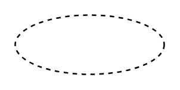

# Derived Attribute

## Definition

```
{
  _style: { 
    entity: 'ellipse;whiteSpace=wrap;html=1;align=center;dashed=1;',
  },
  _original_width: 100,
  _original_height: 40,
}
```

## Usage

```
import { DerivedAttribute } from '@diac/standard-components-diagrams/entityRelation'

<DerivedAttribute/>
```

## Preview


