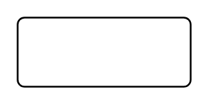

# Entity (Rounded)

## Definition

```
{
  _style: 'rounded=1;arcSize=10;whiteSpace=wrap;html=1;align=center;',
  _width: 100,
  _height: 40,
}
```

## Usage

```
import { EntityRounded } from '@reactiac/standard-components-diagrams/entityRelation'

<EntityRounded/>
```

## Preview


