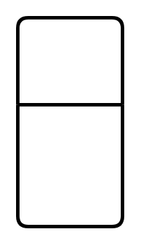

# Entity

## Definition

```
{
  _style: { 
    entity: 'swimlane;childLayout=stackLayout;horizontal=1;startSize=50;horizontalStack=0;rounded=1;fontSize=14;fontStyle=0;strokeWidth=2;resizeParent=0;resizeLast=1;shadow=0;dashed=0;align=center;arcSize=4;whiteSpace=wrap;html=1;',
  },
  _original_width: 0,
  _original_height: 120,
}
```

## Usage

```
import { Entity } from '@diac/standard-components-diagrams/entityRelation'

<Entity/>
```

## Preview


