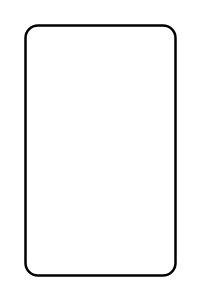

# Hierarchy

## Definition

```
{
  _style: { 
    entity: 'rounded=1;absoluteArcSize=1;html=1;arcSize=10;',
  },
  _original_width: 0,
  _original_height: 100,
}
```

## Usage

```
import { Hierarchy } from '@diac/standard-components-diagrams/entityRelation'

<Hierarchy/>
```

## Preview


