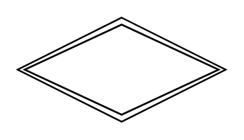

# Identifying Relationship

## Definition

```
{
  _style: 'shape=rhombus;double=1;perimeter=rhombusPerimeter;whiteSpace=wrap;html=1;align=center;',
  _width: 120,
  _height: 60,
}
```

## Usage

```
import { IdentifyingRelationship } from '@diac/standard-components-diagrams/entityRelation'

<IdentifyingRelationship/>
```

## Preview


