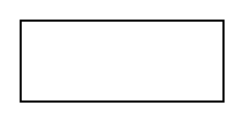
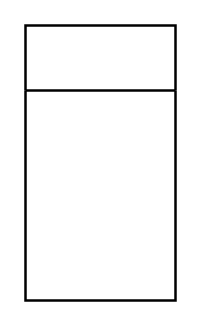

# Software Entity Relation Entities

- [AssociativeEntity](./associative-entity.md)  

- [Attribute](./attribute.md)  

- [Cloud](./cloud.md)  

- [DerivedAttribute](./derived-attribute.md)  

- [Entity](./entity.md)  

- [EntityRounded](./entity-rounded.md)  

- [Entity2](./entity-2.md)  

- [Hierarchy](./hierarchy.md)  

- [IdentifyingRelationship](./identifying-relationship.md)  

- [KeyAttribute](./key-attribute.md)  

- [List](./list.md)  

- [ListItem1](./list-item-1.md)  

- [ListItem2](./list-item-2.md)  

- [ListItem3](./list-item-3.md)  

- [MultivalueAttribute](./multivalue-attribute.md)  

- [Note](./note.md)  

- [Relationship](./relationship.md)  

- [WeakEntity](./weak-entity.md)  

