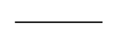

# List Item 3

## Definition

```
{
  _style: { 
    entity: 'line;strokeWidth=1;rotatable=0;dashed=0;labelPosition=right;align=left;verticalAlign=middle;spacingTop=0;spacingLeft=6;points=[];portConstraint=eastwest;',
  },
  _width: 0,
  _height: 10,
}
```

## Usage

```
import { ListItem3 } from '@diac/standard-components-diagrams/entityRelation'

<ListItem3/>
```

## Preview


