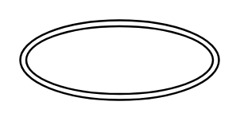

# Multivalue Attribute

## Definition

```
{
  _style: 'ellipse;shape=doubleEllipse;margin=3;whiteSpace=wrap;html=1;align=center;',
  _width: 100,
  _height: 40,
}
```

## Usage

```
import { MultivalueAttribute } from '@diac/standard-components-diagrams/entityRelation'

<MultivalueAttribute/>
```

## Preview


