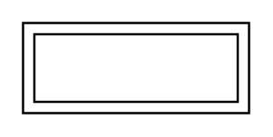

# Weak Entity

## Definition

```
{
  _style: { 
    entity: 'shape=ext;margin=3;double=1;whiteSpace=wrap;html=1;align=center;',
  },
  _width: 100,
  _height: 40,
}
```

## Usage

```
import { WeakEntity } from '@diac/standard-components-diagrams/entityRelation'

<WeakEntity/>
```

## Preview


