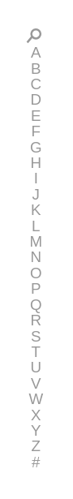

# Alphabet list

## Definition

```
{
  _style: 'verticalLabelPosition=bottom;verticalAlign=top;html=1;shadow=0;dashed=0;strokeWidth=1;shape=mxgraph.ios.iAlphaList;fontSize=7.5;',
  _width: 15,
  _height: 225,
}
```

## Usage

```
import { AlphabetList } from '@reactiac/standard-components-diagrams/ios6'

<AlphabetList/>
```

## Preview


