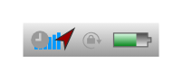

# App bar (portrait)

## Definition

```
{
  _style: { 
    entity: 'html=1;shadow=0;dashed=0;shape=mxgraph.ios.iAppBar;strokeWidth=1;sketch=0;',
  },
  _original_width: 0,
  _original_height: 15,
}
```

## Usage

```
import { AppBarPortrait } from '@dinghy/standard-components-diagrams/ios6'

<AppBarPortrait/>
```

## Preview


