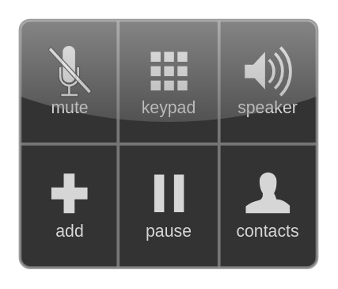

# Call Dialog

## Definition

```
{
  _style: { 
    entity: 'verticalLabelPosition=bottom;verticalAlign=top;html=1;shadow=0;dashed=0;strokeWidth=1;shape=mxgraph.ios.iCallDialog;sketch=0;',
  },
  _original_width: 150,
  _original_height: 125,
}
```

## Usage

```
import { CallDialog } from '@dinghy/standard-components-diagrams/ios6'

<CallDialog/>
```

## Preview


