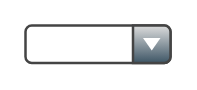

# Combobox

## Definition

```
{
  _style: 'strokeWidth=1;html=1;shadow=0;dashed=0;shape=mxgraph.ios.iComboBox;spacingTop=2;spacingLeft=2;align=left;strokeColor=#444444;fontColor=#666666;buttonText=;fontSize=8;fillColor=#dddddd;fillColor2=#3D5565;sketch=0;whiteSpace=wrap;',
  _width: 57.99999999999999,
  _height: 15,
}
```

## Usage

```
import { Combobox } from '@diac/standard-components-diagrams/ios6'

<Combobox/>
```

## Preview


