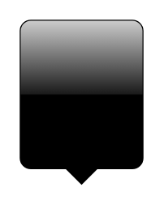

# Copy Area

## Definition

```
{
  _style: { 
    entity: 'html=1;shadow=0;dashed=0;shape=mxgraph.ios.iCopy;fillColor=#000000;buttonText=;fontColor=#ffffff;spacingBottom=6;fontSize=9;fillColor2=#000000;fillColor3=#ffffff;align=center;sketch=0;whiteSpace=wrap;',
  },
  _width: 0,
  _height: 80,
}
```

## Usage

```
import { CopyArea } from '@diac/standard-components-diagrams/ios6'

<CopyArea/>
```

## Preview


