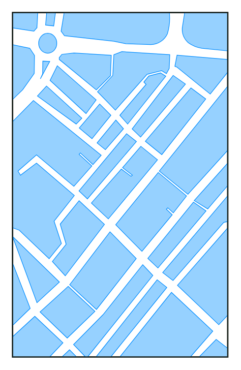

# iPad background (map)

## Definition

```
{
  _style: { 
    entity: 'verticalLabelPosition=bottom;verticalAlign=top;html=1;shadow=0;dashed=0;strokeWidth=1;shape=mxgraph.ios.iBgMap;strokeColor=#18211b;strokeColor2=#008cff;fillColor2=#96D1FF;',
  },
  _width: 175,
  _height: 280,
}
```

## Usage

```
import { IpadBackgroundMap } from '@diac/standard-components-diagrams/ios6'

<IpadBackgroundMap/>
```

## Preview


