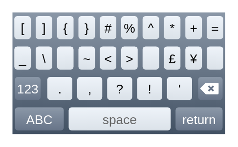

# Keyboard (symbols)

## Definition

```
{
  _style: 'verticalLabelPosition=bottom;verticalAlign=top;html=1;shadow=0;dashed=0;strokeWidth=1;shape=mxgraph.ios.iKeybSymb;sketch=0;',
  _width: 174,
  _height: 100,
}
```

## Usage

```
import { KeyboardSymbols } from '@diac/standard-components-diagrams/ios6'

<KeyboardSymbols/>
```

## Preview


