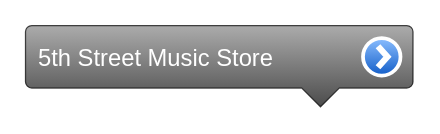

# Location bar

## Definition

```
{
  _style: 'strokeWidth=1;html=1;shadow=0;dashed=0;shape=mxgraph.ios.iLocBar;align=left;spacingLeft=4;spacingBottom=4;fontColor=#ffffff;fontSize=10;barPos=80;pointerPos=bottom;buttonText=5th Street Music Store',
  _width: 155,
  _height: 32.5,
}
```

## Usage

```
import { LocationBar } from '@reactiac/standard-components-diagrams/ios6'

<LocationBar/>
```

## Preview


