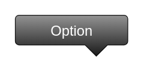

# Option

## Definition

```
{
  _style: 'strokeWidth=1;html=1;shadow=0;dashed=0;shape=mxgraph.ios.iOption;barPos=80;pointerPos=bottom;buttonText=Option;fontSize=10;fontColor=#ffffff;spacingBottom=6;',
  _width: 75,
  _height: 27.500000000000004,
}
```

## Usage

```
import { Option } from '@reactiac/standard-components-diagrams/ios6'

<Option/>
```

## Preview


