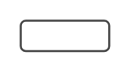

# Password field

## Definition

```
{
  _style: 'strokeWidth=1;html=1;shadow=0;dashed=0;shape=mxgraph.ios.iTextInput;strokeColor=#444444;align=left;buttonText=;fontSize=8;whiteSpace=wrap;',
  _width: 43.5,
  _height: 15,
}
```

## Usage

```
import { PasswordField } from '@diac/standard-components-diagrams/ios6'

<PasswordField/>
```

## Preview


