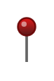

# Pin 2

## Definition

```
{
  _style: 'verticalLabelPosition=top;html=1;shadow=0;dashed=0;verticalAlign=bottom;strokeWidth=1;shape=mxgraph.ios.iPin;fillColor2=#dd0000;fillColor3=#440000;strokeColor=#660000;',
  _width: 10,
  _height: 25,
}
```

## Usage

```
import { Pin2 } from '@reactiac/standard-components-diagrams/ios6'

<Pin2/>
```

## Preview


