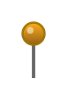

# Pin 5

## Definition

```
{
  _style: { 
    entity: 'verticalLabelPosition=top;html=1;shadow=0;dashed=0;verticalAlign=bottom;strokeWidth=1;shape=mxgraph.ios.iPin;fillColor2=#ffa500;fillColor3=#885000;strokeColor=#997000;',
  },
  _original_width: 10,
  _original_height: 25,
}
```

## Usage

```
import { Pin5 } from '@diac/standard-components-diagrams/ios6'

<Pin5/>
```

## Preview


