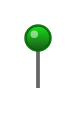

# Pin

## Definition

```
{
  _style: 'verticalLabelPosition=top;html=1;shadow=0;dashed=0;verticalAlign=bottom;strokeWidth=1;shape=mxgraph.ios.iPin;fillColor2=#00dd00;fillColor3=#004400;strokeColor=#006600;',
  _width: 10,
  _height: 25,
}
```

## Usage

```
import { Pin } from '@reactiac/standard-components-diagrams/ios6'

<Pin/>
```

## Preview


