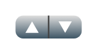

# Prev/next button

## Definition

```
{
  _style: 'verticalLabelPosition=bottom;verticalAlign=top;html=1;shadow=0;dashed=0;strokeWidth=1;shape=mxgraph.ios.iPrevNext;strokeColor=#444444;fillColor=#dddddd;fillColor2=#3D5565;fillColor3=#ffffff;align=center;sketch=0;',
  _width: 43.5,
  _height: 15,
}
```

## Usage

```
import { PrevNextButton } from '@diac/standard-components-diagrams/ios6'

<PrevNextButton/>
```

## Preview


