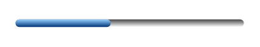

# Progress bar

## Definition

```
{
  _style: 'verticalLabelPosition=bottom;verticalAlign=top;html=1;shadow=0;dashed=0;strokeWidth=1;shape=mxgraph.ios.iProgressBar;barPos=40;',
  _width: 150,
  _height: 10,
}
```

## Usage

```
import { ProgressBar } from '@reactiac/standard-components-diagrams/ios6'

<ProgressBar/>
```

## Preview


