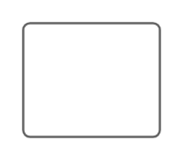

# Radio buttons

## Definition

```
{
  _style: { 
    entity: 'swimlane;shape=mxgraph.bootstrap.rrect;rSize=3;strokeColor=#666666;fillColor=#ffffff;fontColor=#666666;fontStyle=0;childLayout=stackLayout;horizontal=1;startSize=0;horizontalStack=0;resizeParent=1;resizeParentMax=0;resizeLast=0;collapsible=0;marginBottom=0;whiteSpace=wrap;html=1;',
  },
  _original_width: 0,
  _original_height: 50,
}
```

## Usage

```
import { RadioButtons } from '@diac/standard-components-diagrams/ios6'

<RadioButtons/>
```

## Preview


