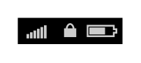

# Top bar locked

## Definition

```
{
  _style: { 
    entity: 'html=1;shadow=0;dashed=0;shape=mxgraph.ios.iTopBarLocked;strokeWidth=1;sketch=0;',
  },
  _width: 0,
  _height: 15,
}
```

## Usage

```
import { TopBarLocked } from '@diac/standard-components-diagrams/ios6'

<TopBarLocked/>
```

## Preview


