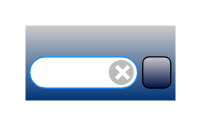

# URL bar

## Definition

```
{
  _style: { 
    entity: 'html=1;shadow=0;dashed=0;shape=mxgraph.ios.iURLBar;verticalAlign=top;fontSize=8;spacingTop=-5;align=center;sketch=0;whiteSpace=wrap;',
  },
  _original_width: 0,
  _original_height: 30,
}
```

## Usage

```
import { UrlBar } from '@diac/standard-components-diagrams/ios6'

<UrlBar/>
```

## Preview


