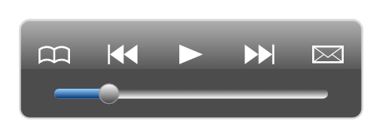

# Video controls

## Definition

```
{
  _style: 'verticalLabelPosition=bottom;verticalAlign=top;html=1;shadow=0;dashed=0;strokeWidth=1;shape=mxgraph.ios.iVideoControls;barPos=20;sketch=0;',
  _width: 174,
  _height: 50,
}
```

## Usage

```
import { VideoControls } from '@reactiac/standard-components-diagrams/ios6'

<VideoControls/>
```

## Preview


