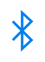

# Bluetooth

## Definition

```
{
  _style: 'html=1;verticalLabelPosition=bottom;align=center;labelBackgroundColor=#ffffff;verticalAlign=top;strokeWidth=2;strokeColor=#0080F0;shadow=0;dashed=0;shape=mxgraph.ios7.icons.bluetooth;pointerEvents=1',
  _width: 15,
  _height: 28.799999999999997,
}
```

## Usage

```
import { Bluetooth } from '@diac/standard-components-diagrams/ios7Icons'

<Bluetooth/>
```

## Preview


