# iOS iOS7 Icons Entities

- [Add](./add.md)  

- [AlarmClock](./alarm-clock.md)  

- [Back](./back.md)  

- [Backward](./backward.md)  

- [Bag](./bag.md)  

- [BasketCancel](./basket-cancel.md)  

- [Basketball](./basketball.md)  

- [Battery](./battery.md)  

- [Bell](./bell.md)  

- [Bluetooth](./bluetooth.md)  

- [Book](./book.md)  

- [Bookmark](./bookmark.md)  

- [Box](./box.md)  
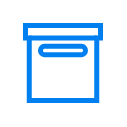

- [Briefcase](./briefcase.md)  

- [Calculator](./calculator.md)  

- [Calendar](./calendar.md)  
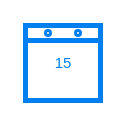

- [Camera](./camera.md)  

- [Chat](./chat.md)  

- [Clock](./clock.md)  
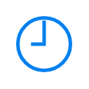

- [Cloud](./cloud.md)  

- [Compose](./compose.md)  

- [Controls](./controls.md)  

- [CreditCard](./credit-card.md)  

- [Crop](./crop.md)  
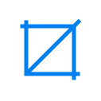

- [Cube](./cube.md)  
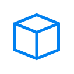

- [Cup](./cup.md)  

- [Data](./data.md)  

- [Delete](./delete.md)  
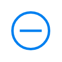

- [Document](./document.md)  

- [Documents](./documents.md)  
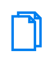

- [Down](./down.md)  

- [Edit](./edit.md)  

- [EnvelopeEmpty](./envelope-empty.md)  

- [EnvelopeMessage](./envelope-message.md)  

- [Eye](./eye.md)  
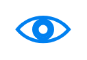

- [Flag](./flag.md)  

- [Flash](./flash.md)  

- [Flashlight](./flashlight.md)  

- [Folder](./folder.md)  
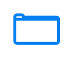

- [Folders](./folders.md)  

- [Folders2](./folders-2.md)  

- [Forward](./forward.md)  
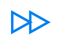

- [Gauge](./gauge.md)  

- [Glasses](./glasses.md)  
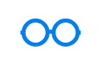

- [Globe](./globe.md)  

- [Heart](./heart.md)  

- [Help](./help.md)  

- [Home](./home.md)  

- [Info](./info.md)  
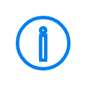

- [Keypad](./keypad.md)  
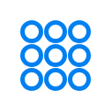

- [Lightbulb](./lightbulb.md)  

- [Link](./link.md)  

- [Location](./location.md)  

- [Location2](./location-2.md)  

- [Locked](./locked.md)  

- [LookingGlass](./looking-glass.md)  

- [Loud](./loud.md)  

- [Magnet](./magnet.md)  

- [Mail](./mail.md)  

- [Map](./map.md)  

- [Message](./message.md)  

- [Messages](./messages.md)  

- [Microphone](./microphone.md)  
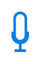

- [Monitor](./monitor.md)  

- [Moon](./moon.md)  

- [MostViewed](./most-viewed.md)  

- [MoveToFolder](./move-to-folder.md)  

- [Note](./note.md)  

- [Options](./options.md)  

- [OrientationLock](./orientation-lock.md)  

- [PageNavigation](./page-navigation.md)  

- [Paint](./paint.md)  

- [Pause](./pause.md)  
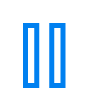

- [Pen](./pen.md)  
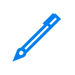

- [PieChart](./pie-chart.md)  
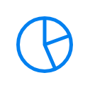

- [Play](./play.md)  

- [Pointer](./pointer.md)  

- [Preferences](./preferences.md)  

- [Printer](./printer.md)  

- [Privacy](./privacy.md)  
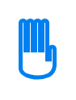

- [Radio](./radio.md)  
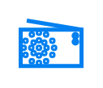

- [Reload](./reload.md)  
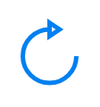

- [Repeat](./repeat.md)  

- [Retry](./retry.md)  

- [Select](./select.md)  

- [Settings](./settings.md)  

- [Share](./share.md)  

- [ShoppingCart](./shopping-cart.md)  

- [Shuffle](./shuffle.md)  

- [Silent](./silent.md)  

- [Smartphone](./smartphone.md)  

- [Star](./star.md)  

- [Stopwatch](./stopwatch.md)  

- [Storage](./storage.md)  

- [Sun](./sun.md)  

- [Tape](./tape.md)  
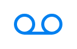

- [Tools](./tools.md)  
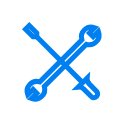

- [Trashcan](./trashcan.md)  

- [Trophy](./trophy.md)  

- [Umbrella](./umbrella.md)  
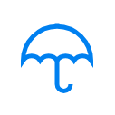

- [Unlocked](./unlocked.md)  

- [Up](./up.md)  

- [User](./user.md)  

- [VideoConversation](./video-conversation.md)  

- [Volume](./volume.md)  
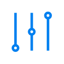

- [Volume2](./volume-2.md)  

- [Wallet](./wallet.md)  
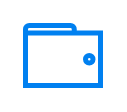

- [Wifi](./wifi.md)  

- [Window](./window.md)  
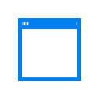
