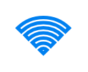

# WiFi

## Definition

```
{
  _style: { 
    entity: 'html=1;verticalLabelPosition=bottom;align=center;labelBackgroundColor=#ffffff;verticalAlign=top;strokeWidth=2;strokeColor=#0080F0;shadow=0;dashed=0;shape=mxgraph.ios7.icons.wifi;pointerEvents=1',
  },
  _original_width: 29.7,
  _original_height: 21,
}
```

## Usage

```
import { Wifi } from '@dinghy/standard-components-diagrams/ios7Icons'

<Wifi/>
```

## Preview


