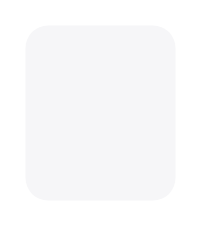

# Alert

## Definition

```
{
  _style: 'shape=rect;rounded=1;strokeColor=none;fillColor=#F6F6F8;gradientColor=none;shadow=0;glass=0;dashed=1;fontFamily=Helvetica;fontSize=7;fontColor=#333333;align=center;html=1;verticalAlign=top;whiteSpace=wrap;spacing=8;spacingTop=0;',
  _width: 0,
  _height: 70,
}
```

## Usage

```
import { Alert } from '@reactiac/standard-components-diagrams/ios7Ui'

<Alert/>
```

## Preview


