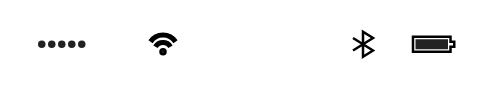

# App Bar (portrait)

## Definition

```
{
  _style: 'html=1;strokeWidth=1;shadow=0;dashed=0;shape=mxgraph.ios7ui.appBar;fillColor=#ffffff;gradientColor=none;sketch=0;hachureGap=4;pointerEvents=0;',
  _width: 175,
  _height: 15,
}
```

## Usage

```
import { AppBarPortrait } from '@diac/standard-components-diagrams/ios7Ui'

<AppBarPortrait/>
```

## Preview


