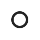

# Circle

## Definition

```
{
  _style: 'html=1;verticalLabelPosition=bottom;labelBackgroundColor=#ffffff;verticalAlign=top;shadow=0;dashed=0;strokeWidth=2;shape=mxgraph.ios7.misc.circle;strokeColor=#222222;fillColor=none;',
  _width: 12,
  _height: 12,
}
```

## Usage

```
import { Circle } from '@reactiac/standard-components-diagrams/ios7Ui'

<Circle/>
```

## Preview


