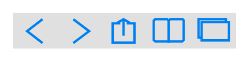

# Contacts Bar

## Definition

```
{
  _style: { 
    entity: 'html=1;verticalLabelPosition=bottom;labelBackgroundColor=#ffffff;verticalAlign=top;shadow=0;dashed=0;strokeWidth=2;shape=mxgraph.ios7.misc.contacts_bar;strokeColor=#0080F0;fillColor=#e0e0e0',
  },
  _original_width: 175,
  _original_height: 28.000000000000004,
}
```

## Usage

```
import { ContactsBar } from '@dinghy/standard-components-diagrams/ios7Ui'

<ContactsBar/>
```

## Preview


