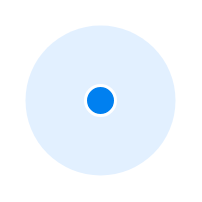

# Current Location

## Definition

```
{
  _style: 'html=1;verticalLabelPosition=bottom;labelBackgroundColor=#ffffff;verticalAlign=top;shadow=0;dashed=0;strokeWidth=2;shape=mxgraph.ios7.misc.current_location;strokeColor=#ffffff;fillColor=#0080F0;sketch=0;',
  _width: 60,
  _height: 60,
}
```

## Usage

```
import { CurrentLocation } from '@reactiac/standard-components-diagrams/ios7Ui'

<CurrentLocation/>
```

## Preview


