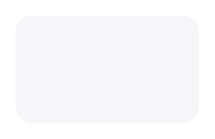

# Dialog

## Definition

```
{
  _style: { 
    entity: 'shape=rect;rounded=1;strokeColor=none;fillColor=#F6F6F8;gradientColor=none;shadow=0;glass=0;dashed=1;fontFamily=Helvetica;fontSize=8;fontColor=#333333;align=center;html=1;verticalAlign=top;whiteSpace=wrap;spacing=2;spacingTop=0;',
  },
  _original_width: 120,
  _original_height: 70,
}
```

## Usage

```
import { Dialog } from '@dinghy/standard-components-diagrams/ios7Ui'

<Dialog/>
```

## Preview


