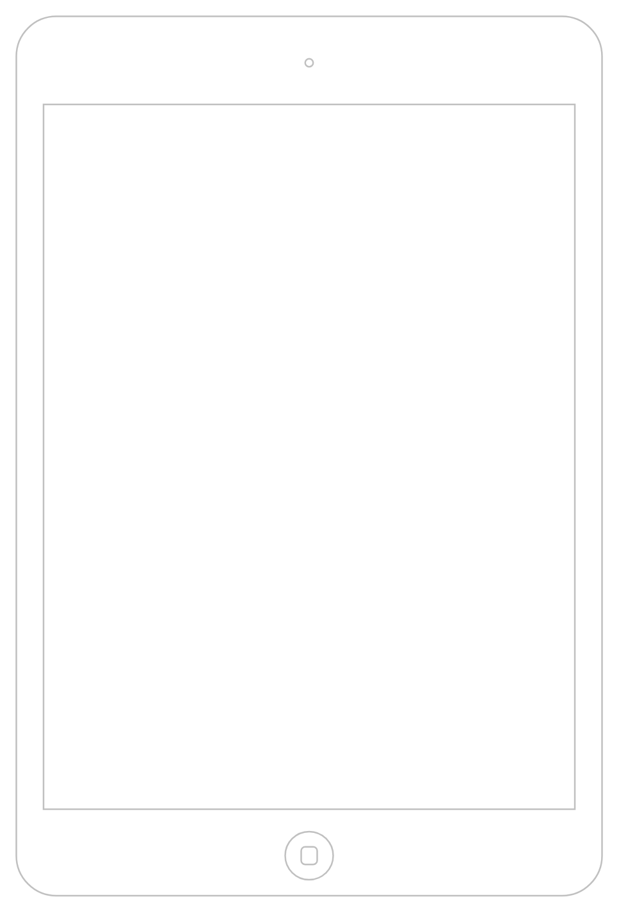

# iPad (7&#39;&#39;)

## Definition

```
{
  _style: { 
    entity: 'html=1;verticalLabelPosition=bottom;labelBackgroundColor=#ffffff;verticalAlign=top;shadow=0;dashed=0;strokeWidth=1;shape=mxgraph.ios7.misc.ipad7inch;strokeColor=#c0c0c0;',
  },
  _original_width: 366,
  _original_height: 549,
}
```

## Usage

```
import { Ipad7 } from '@dinghy/standard-components-diagrams/ios7Ui'

<Ipad7/>
```

## Preview


