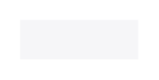

# Labels

## Definition

```
{
  _style: { 
    entity: 'shape=rect;fillColor=#F6F6F8;strokeColor=none;',
  },
  _original_width: 0,
  _original_height: 20,
}
```

## Usage

```
import { Labels } from '@diac/standard-components-diagrams/ios7Ui'

<Labels/>
```

## Preview


