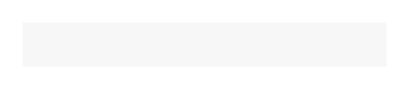

# Message

## Definition

```
{
  _style: 'shape=rect;fillColor=#F7F7F7;strokeColor=none;',
  _width: 164,
  _height: 20,
}
```

## Usage

```
import { Message } from '@reactiac/standard-components-diagrams/ios7Ui'

<Message/>
```

## Preview


