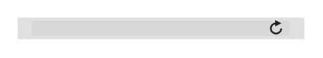

# URL

## Definition

```
{
  _style: { 
    entity: 'html=1;strokeWidth=1;shadow=0;dashed=0;shape=mxgraph.ios7ui.url;fillColor=#e0e0e0;strokeColor=#c0c0c0;buttonText=;strokeColor2=#222222;fontColor=#222222;fontSize=8;spacingTop=2;align=center;whiteSpace=wrap;',
  },
  _original_width: 165,
  _original_height: 12.5,
}
```

## Usage

```
import { Url } from '@dinghy/standard-components-diagrams/ios7Ui'

<Url/>
```

## Preview


