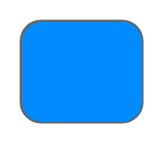

# Formatted Button

## Definition

```
{
  _style: { 
    entity: 'strokeWidth=1;shadow=0;dashed=0;align=center;html=1;shape=mxgraph.mockup.buttons.multiButton;fillColor=#008cff;strokeColor=#666666;mainText=;subText=;',
  },
  _width: 0,
  _height: 50,
}
```

## Usage

```
import { FormattedButton } from '@diac/standard-components-diagrams/mockupButtons'

<FormattedButton/>
```

## Preview


