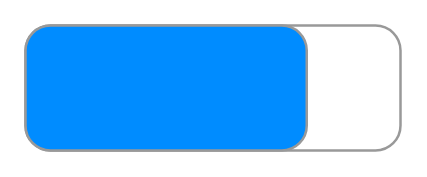

# On-off button

## Definition

```
{
  _style: 'strokeWidth=1;shadow=0;dashed=0;align=center;html=1;shape=mxgraph.mockup.buttons.onOffButton;gradientColor=none;strokeColor=#999999;buttonState=on;fillColor2=#008cff;fontColor=#ffffff;fontSize=17;mainText=;spacingRight=40;fontStyle=1;whiteSpace=wrap;',
  _width: 150,
  _height: 50,
}
```

## Usage

```
import { OnOffButton } from '@reactiac/standard-components-diagrams/mockupButtons'

<OnOffButton/>
```

## Preview


