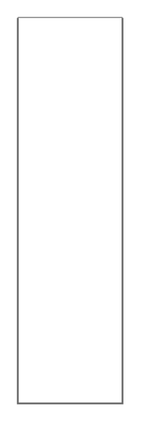

# Accordion

## Definition

```
{
  _style: 'swimlane;strokeColor=#666666;swimlaneFillColor=#FFFFFF;fillColor=#ffffff;fontColor=#008CFF;fontStyle=0;childLayout=stackLayout;horizontal=1;startSize=0;horizontalStack=0;resizeParent=1;resizeParentMax=0;resizeLast=0;collapsible=0;marginBottom=0;whiteSpace=wrap;html=1;fontSize=17;',
  _width: 0,
  _height: 220,
}
```

## Usage

```
import { Accordion } from '@diac/standard-components-diagrams/mockupContainers'

<Accordion/>
```

## Preview


