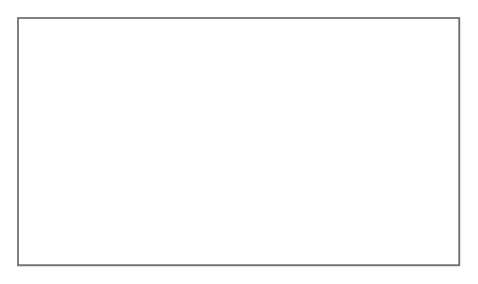

# Dialog Box

## Definition

```
{
  _style: 'strokeWidth=1;shadow=0;dashed=0;align=center;html=1;shape=mxgraph.mockup.containers.rrect;rSize=0;strokeColor=#666666;fontColor=#666666;fontSize=17;verticalAlign=top;whiteSpace=wrap;fillColor=#ffffff;spacingTop=32;',
  _width: 250,
  _height: 140,
}
```

## Usage

```
import { DialogBox } from '@reactiac/standard-components-diagrams/mockupContainers'

<DialogBox/>
```

## Preview


